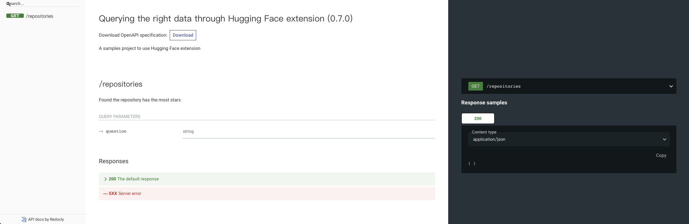

# Table Question Answering

The project demonstrates how VulcanSQL can leverage the power of [Hugging Face Table Question Answering](https://huggingface.co/tasks/table-question-answering) through the `huggingface_table_question_answering` filter to perform simple data queries.

Datasets: https://www.kaggle.com/datasets/chasewillden/topstarredopensourceprojects

Used [DuckDB connector](https://vulcansql.com/docs/connect/duckdb) be the data source and get the CSV result from DuckDB function.

## Setup

1. Install VulcanSQL CLI package, here use `yarn`, you could use `npm` by yourself.

```bash
$ yarn install -g @vulcan-sql/cli
```

2. Go to the project directory and install all the packages from `package.json`

```bash
$ yarn install
```

3. Start VulcanSQL in the terminal

```bash
$ vulcan start --watch
```

Now the API docs is auto generated at http://localhost:3000/doc and API `/repositories` already.

## Screenshot

### API Document



### API Request & Response

Here We use [Postman](https://www.postman.com/) to send API Request.

1. Send the `Find the repository has the most stars?` question by query string:


VulcanSQL responds to the HuggingFace Table Question Answering original output, but converts it to a JSON string.

2. Send the `How many repositories use Python language? Give repository name` question by query string:


Same output format as the above, VulcanSQL responds to the HuggingFace Table Question Answering original output, but converts it to a JSON string.

### References

For more information about VulcanSQL `huggingface_table_question_answering` filter, please see [HuggingFace extension](https://vulcansql.com/docs/extensions/huggingface/overview).
