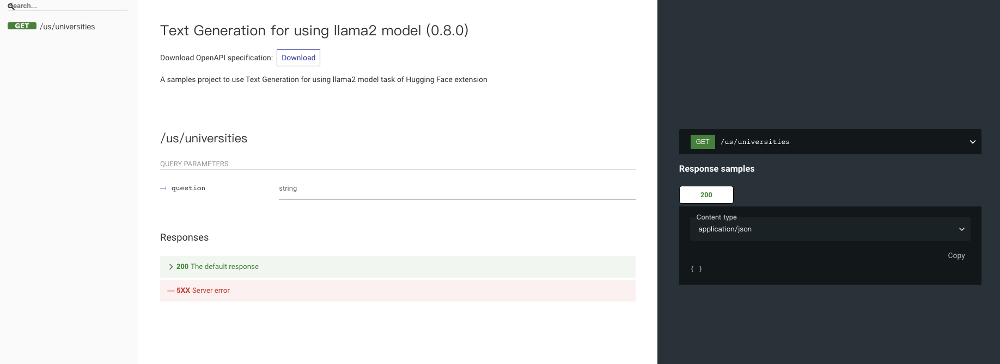

# Text Generation - Using Llama2

The project demonstrates how VulcanSQL can leverage the power of Hugging Face Text Generation `huggingface_text_generation` filter with [Llama-2-13b-chat-hf](https://huggingface.co/meta-llama/Llama-2-13b-chat-hf) model to perform simple data queries.

Datasets: https://www.kaggle.com/datasets/jkanthony/world-university-rankings-202223

Used [DuckDB connector](https://vulcansql.com/docs/connect/duckdb) be the data source and get the CSV result from DuckDB function.

## Setup

1. Install VulcanSQL CLI package, here use `yarn`, you could use `npm` by yourself.

```bash
$ yarn install -g @vulcan-sql/cli
```

2. Go to the project directory and install all the packages from `package.json`

```bash
$ yarn install
```

3. Create your HuggingFace  [User Access Token](https://huggingface.co/docs/hub/security-tokens) and add to `vulcan.yaml`. Please make sure you have [HuggingFace Pro Account](https://huggingface.co/pricing#pro):

```yaml
hf:
  accessToken: "<your access token>"
```


4. Start VulcanSQL in the terminal

```bash
$ vulcan start --watch
```


Now the API docs is auto generated at http://localhost:3000/doc and API `/us/repositories` already.

## Screenshot

### API Document



### API Request & Response

Here We use [Postman](https://www.postman.com/) to send API Request.

1. Send the `Which university is the top-ranked university?` question by query string:


VulcanSQL responds to the HuggingFace Text Generation original output, but converts it to a JSON string.

2. Send the `Which university located in the UK is ranked at the top of the list?` question by query string:


Same output format as the above, VulcanSQL responds to the HuggingFace Text Generation original output, but retrieve the `generated_text` string value.

### References

For more information about VulcanSQL `huggingface_text_generation` filter, please see [HuggingFace extension](https://vulcansql.com/docs/extensions/huggingface/overview).
