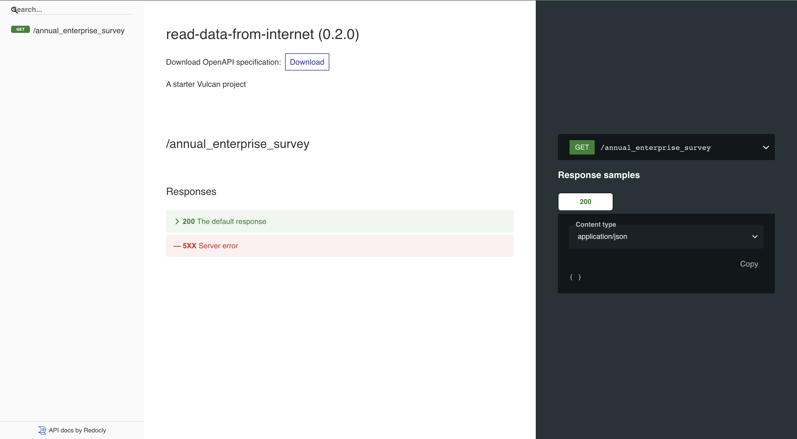

# Reading Data from the Internet

Since now VulcanSQL has support of the [`httpfs` extention in DuckDB](https://duckdb.org/docs/extensions/httpfs.html), we can directly query data from the Internet.

## Setup

- install VulcanSQL: `npm install -g @vulcan-sql/cli`
- go to the project directory: `npm install`
    - in one terminal: `vulcan start --watch`, now the API docs is auto generated at `http://localhost:3000/doc`
    - in another terminal: `vulcan catalog`, now the API catalog is at `http://localhost:4200`

## Screenshots

API docs

After clicking the Connect button...

To understand more what VulcanSQL is and how it works, please check out https://vulcansql.com/